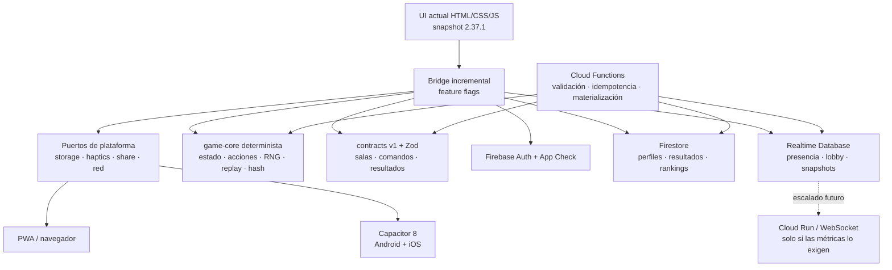
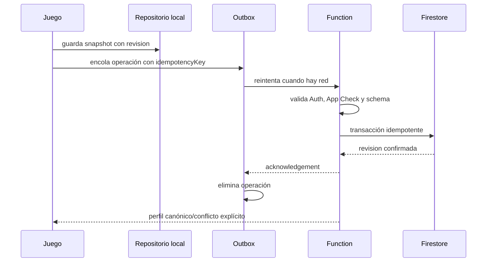
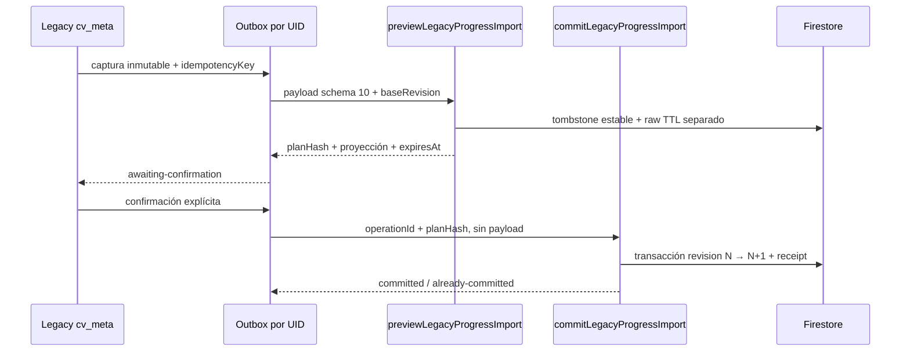

# Arquitectura v2

## Decisión principal

Convergence v2 usa una migración incremental alrededor del cliente vanilla
existente. Capacitor 8 empaqueta el mismo artefacto web para Android e iOS. Las
reglas se extraen gradualmente a TypeScript puro y Firebase se consume mediante
puertos, no desde la lógica de juego.

## Límites

### Cliente estable

`apps/client/web` es una copia literal del runtime actual. Su build solo copia
una allowlist a `apps/client/dist`. No se minifica, transpila ni importa todavía
ningún módulo nuevo. Esto reduce el riesgo y conserva PWA, ES/EN, accesibilidad,
safe areas, modos, economía, cofres, cosméticos, efectos y comportamiento
offline.

Las integraciones se prueban en carriles separados: `dist-emulator` añade Auth
loopback, `dist-cloud-dev` conecta exclusivamente Auth al proyecto `dev` y
`dist-profile-emulator` compone Auth/App Check/Functions solo contra emuladores.
Todos parten directamente de la allowlist estable, usan bundle/CSP mínimos y
están ignorados. Hosting y Capacitor continúan apuntando a `dist`; consultar los
ADR 0006, 0007 y 0008.

### Capa de plataforma

El juego no debería usar directamente `localStorage`, `navigator.share`,
vibración o listeners de red. Los adaptadores Web/Capacitor ofrecen una interfaz
asíncrona uniforme. En nativo, Preferences sustituirá progresivamente a
localStorage, que no se considera almacenamiento durable garantizado del
WebView.

El repositorio JSON valida al leer y pone documentos corruptos en cuarentena.
El outbox v2 liga cada operación al UID, serializa mutaciones, aplica leases,
recuperación tras process death, backoff con jitter/`Retry-After` y estados
terminales diferenciados para Auth, conflicto y error permanente. Nunca procesa
una cola perteneciente a otra identidad.

### Núcleo determinista

`packages/game-core` no puede importar DOM, Firebase ni Capacitor. Recibe estado
y acciones y produce un nuevo estado. Su PRNG es compatible con Mulberry32 del
runtime 2.37.1 y ahora permite snapshot/restore. El objetivo es poder ejecutar
exactamente las mismas reglas en cliente, pruebas y validador backend.

### Contratos

`packages/contracts` versiona y valida los datos que cruzan límites de red. Un
payload TypeScript no se considera válido hasta pasar el schema runtime. Todo
comando mutable incluye:

- versión de protocolo;
- identidad/partida cuando el contrato lo requiera; el UID autoritativo nunca
  procede del payload cliente;
- secuencia;
- idempotency key;
- timestamp cliente informativo;
- hash del estado anterior cuando aplique.

## Firebase por responsabilidad

| Servicio | Responsabilidad | No se usa para |
|---|---|---|
| Auth | identidad anónima y upgrade a cuenta | autorizar solo desde la UI |
| App Check | reducir clientes no legítimos | sustituir reglas o validación |
| Firestore | perfil durable, auditoría, resultados y rankings | ticks/snapshots frecuentes |
| Realtime Database | presencia, lobby y estado caliente | economía autoritativa |
| Functions | comandos privilegiados, validación y materialización | loop permanente de baja latencia |
| Storage | futuro: replays grandes/avatares validados | datos hasta definir reglas/límites |

Functions usa Admin SDK y es la única capa que escribe economía, resultados
verificados y rankings. Las reglas iniciales están cerradas por defecto.

## Flujo de progreso offline

No se aplicará “last write wins” ciego sobre progreso. La estrategia exacta se
cerrará por campo: máximos para récords, transacciones server-side para economía
y revisión explícita para inventario/loadout.

`LegacyProgressImportV1` ya define el transporte inicial de `cv_meta` schema 10:
idempotency key, revisión base, límites JSON y ninguna identidad aportada por el
cliente. La vertical local implementa dos callables separadas: preview conserva
un tombstone idempotente y guarda el raw como JSON canónico en un documento TTL
separado; devuelve únicamente una proyección/plan. Commit exige confirmación
exacta, vuelve a comprobar revisión e idempotencia y registra una reclamación no
verificada. El payload nunca llega al perfil ni concede economía/cofres/ranking.

La primera implementación corre solo en Emulator Suite mediante
`dist-profile-emulator`; el build estable, Hosting y Capacitor no la cargan. La
UI visible de confirmación y el despliegue cloud siguen siendo gates separados.
Consultar el ADR 0005.

## Salas y partidas

1. `createRoom/joinRoom` valida en Function y crea membership.
2. RTDB publica presencia, ready state y cambios de lobby.
3. `startMatch` congela miembros, versión, seed y configuración.
4. Cada acción usa secuencia e idempotencia; el cliente puede anticipar UI.
5. Snapshots periódicos incluyen hash y último comando aceptado.
6. Una reconexión descarta predicción local posterior al último ack y reproduce.
7. El cierre valida replay/resultado y materializa ranking en Firestore.

Para el primer MVP se usará Firebase y validación de checkpoints. Si p95 de
latencia, frecuencia de escritura, coste o anti-cheat no cumplen los objetivos,
el árbitro se mueve a Cloud Run/WebSocket conservando contratos y core.

## Entornos y despliegue

Se prevén proyectos Firebase separados para `dev`, `staging` y `prod`. No se
reutilizan bases entre entornos. El repositorio no incluye `.firebaserc` real,
credenciales, claves de firma ni archivos APNs.

No existe script `deploy` hasta que:

1. regiones y localizaciones estén confirmadas;
2. reglas tengan tests de emulador;
3. aliases apunten a proyectos verificados;
4. presupuesto/alertas estén activos;
5. el usuario autorice el primer despliegue.
